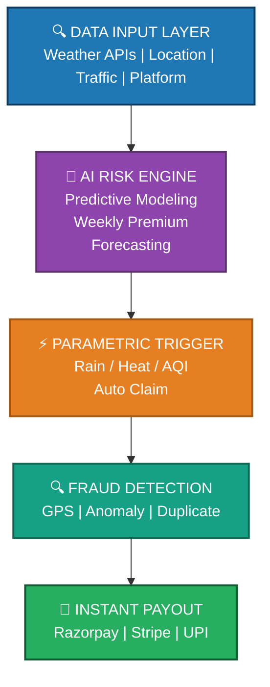

# AI-Powered-Insurance-for-India-s-Gig-Economy
Guidewire DEVTrails 2026
# 🚀 AI-Powered Parametric Insurance for Gig Workers  
### 🛡️ Protecting Income. Empowering India’s Workforce.

<p align="center">
⚡ Real-time Protection | 🤖 AI Driven | 💸 Instant Payouts | 📅 Weekly Plans
</p>

<p align="center">


</p>

---

## 🌍 PROBLEM STATEMENT

India’s gig economy is growing rapidly, but delivery partners face **unpredictable income loss** due to external disruptions:

🌧️ Extreme weather  
🌫️ Pollution spikes  
🚫 Curfews & restrictions  

📉 Result: **20–30% income loss**  
❌ No financial safety net  

---

## 💡 OUR SOLUTION

We propose an **AI-powered parametric insurance platform** that:

- 🤖 Predicts risks using AI  
- ⚡ Detects disruptions in real-time  
- 💸 Instantly triggers payouts  
- 📅 Uses a **weekly pricing model**  

👉 No claims. No delays. Fully automated.

---

## 👤 TARGET USER

**Delivery Partner (Food / Grocery / E-commerce)**

- Works daily for income  
- Highly dependent on external conditions  
- No backup income system  

---

## ⚡ SYSTEM ARCHITECTURE


## ⚡ REAL-TIME CLAIM FLOW
```text
┌──────────────────────────────────────────────┐
│ 👤 USER ACTIVE                               │
└──────────────────────────────────────────────┘
                     │
                     ▼
┌──────────────────────────────────────────────┐
│ 📡 SYSTEM MONITORING (24/7)                  │
│   • Tracking weather                         │
│   • Monitoring location                      │
└──────────────────────────────────────────────┘
                     │
                     ▼
┌──────────────────────────────────────────────┐
│ 🌧️ DISRUPTION DETECTED                      │
│   • Rain / Heat / AQI                        │
└──────────────────────────────────────────────┘
                     │
                     ▼
┌──────────────────────────────────────────────┐
│ 🤖 AI VALIDATION                             │
│   • Risk verification                        │
│   • Event confirmation                       │
└──────────────────────────────────────────────┘
                     │
                     ▼
┌──────────────────────────────────────────────┐
│ 🔍 FRAUD CHECK                               │
│   • GPS validation                           │
│   • Anomaly detection                        │
└──────────────────────────────────────────────┘
                     │
                     ▼
┌──────────────────────────────────────────────┐
│ 💸 INSTANT PAYOUT                            │
│   • Auto credit to user                      │
└──────────────────────────────────────────────┘
```

---

## 💰 WEEKLY PRICING MODEL

```text
┌──────────────────────────────────────────────┐
│           📊 INPUT FACTORS                   │
│  • Location Risk Score                       │
│  • Weather Forecast                          │
│  • Historical Disruption Data                │
└──────────────────────────────────────────────┘
                     │
                     ▼
┌──────────────────────────────────────────────┐
│           🤖 AI CALCULATION                  │
│  • Dynamic Premium Engine                    │
│  • Weekly Risk-Based Pricing                 │
└──────────────────────────────────────────────┘
                     │
                     ▼
┌──────────────────────────────────────────────┐
│           💸 FINAL OUTPUT                    │
│  • ₹20 – ₹50 per week                       │
│  • Adaptive & Personalized Pricing          │
└──────────────────────────────────────────────┘
```
## 🛡️ FRAUD DEFENSE SYSTEM

```text
┌──────────────────────────────────────────────┐
│ 🛡️ MULTI-LAYER FRAUD PROTECTION SYSTEM      │
└──────────────────────────────────────────────┘
                     │
                     ▼
┌──────────────────────────────────────────────┐
│ 📍 LAYER 1: GPS VERIFICATION                │
│  • Detects spoofed locations                │
│  • Ensures real-time tracking               │
└──────────────────────────────────────────────┘
                     │
                     ▼
┌──────────────────────────────────────────────┐
│ 📊 LAYER 2: BEHAVIOR ANALYSIS               │
│  • Identifies unusual claim patterns        │
│  • Tracks abnormal activity                │
└──────────────────────────────────────────────┘
                     │
                     ▼
┌──────────────────────────────────────────────┐
│ 🧠 LAYER 3: AI ANOMALY DETECTION            │
│  • Flags suspicious claims instantly        │
│  • Learns evolving fraud patterns           │
└──────────────────────────────────────────────┘
                     │
                     ▼
┌──────────────────────────────────────────────┐
│ 🔁 LAYER 4: DUPLICATE CLAIM FILTER          │
│  • Prevents repeated claims                 │
│  • Cross-verifies claim history             │
└──────────────────────────────────────────────┘
                     │
                     ▼
┌──────────────────────────────────────────────┐
│ ⚡ LAYER 5: CIRCUIT BREAKER SYSTEM          │
│  • Temporarily blocks suspicious zones      │
│  • Prevents mass fraud attempts             │
└──────────────────────────────────────────────┘
```

---

## 🚨 PARAMETRIC TRIGGERS

🌧️ Heavy Rainfall  
🌡️ Extreme Heat  
🌫️ Hazardous AQI  
🚫 Zone Restrictions  

⚡ → **AUTO CLAIM TRIGGERED**

---

## ⚖️ BEFORE vs AFTER

```text
┌────────────────────────────┬────────────────────────────┐
│         ❌ BEFORE           │          ✅ AFTER           │
├────────────────────────────┼────────────────────────────┤
│ No income protection       │ Weekly income security     │
│ Manual claim process       │ Auto-triggered claims      │
│ Delayed payouts            │ Instant payouts            │
│ High uncertainty           │ Predictable earnings       │
│ No safety net              │ AI-driven protection       │
└────────────────────────────┴────────────────────────────┘
```

---

## 📊 IMPACT

🚴 10M+ Gig Workers  
📉 30% Income Loss Reduced  
⚡ <5 sec Claim Processing  
💸 Instant Relief  

---

## 🧠 AI INTEGRATION

- 📊 Risk Prediction Model  
- 💰 Dynamic Premium Engine  
- 🔍 Fraud Detection AI  
- 📡 Real-time Monitoring  

---

## 🛠️ TECH STACK

**Frontend:** React / Next.js  
**Backend:** Node.js / Express  
**AI/ML:** Python, Scikit-learn  
**Database:** MongoDB / PostgreSQL  
**APIs:** Weather, Traffic (Mock)  
**Payments:** Razorpay / Stripe  

---

## 📅 DEVELOPMENT ROADMAP

### 🟢 Phase 1: Ideation
- Persona & problem analysis  
- Workflow design  
- AI planning  

### 🟡 Phase 2: Build
- Policy system  
- Dynamic pricing  
- Claims automation  

### 🔴 Phase 3: Scale
- Fraud detection  
- Instant payouts  
- Dashboard  

---

## 🏆 WHY THIS PROJECT STANDS OUT

✔ Real-world impact  
✔ AI-driven automation  
✔ Zero-touch claims  
✔ Fraud-proof system  
✔ Scalable across India  

🔥 Built like a product, not just a project  

---

## 👥 TEAM

- Vansh Yadav
- Om Prakash Samal 
- Nilanshu Sharma
- Vaibhavi Sharma
- Akhilesh Menon

---

## 💬 FINAL NOTE

> “Earn without fear. We've got your back.”
